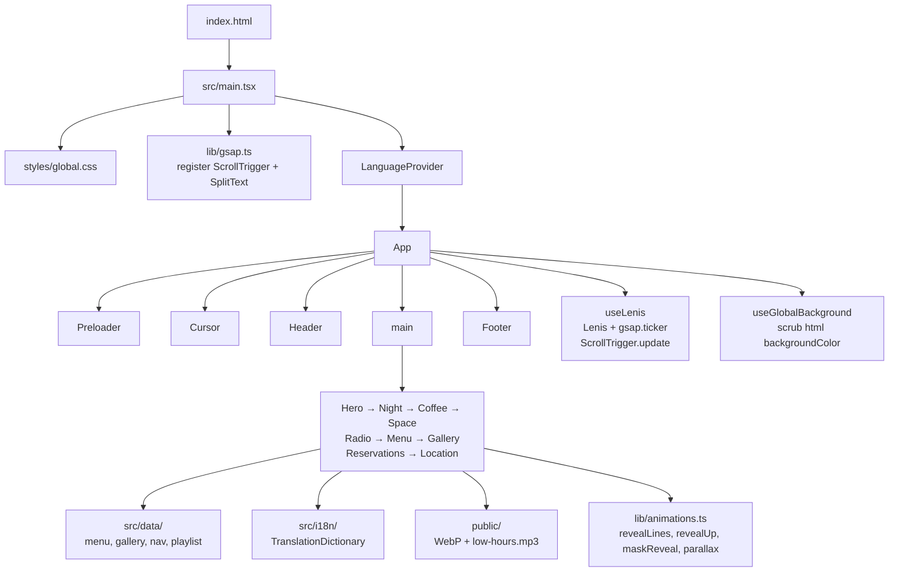
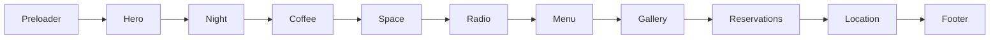
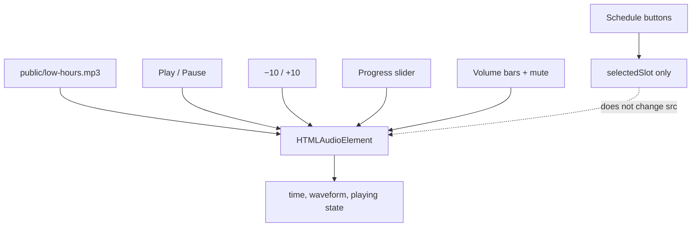

# LOW HOURS

Static single-page landing for a fictional late-night café. The site is a frontend showcase: scroll-driven motion, bilingual copy, a local audio player, and a reservations form that never leaves the browser.

Stay a little longer. Coffee for slow nights.

[](https://react.dev)
[](https://www.typescriptlang.org)
[](https://vite.dev)
[](https://gsap.com)
[](https://github.com/darkroomengineering/lenis)
[](https://oxc.rs/docs/guide/usage/linter)

## Concept

LOW HOURS is a visual SPA for a quiet café open **18:00–04:00**. Copy, menu, gallery, and location are local TypeScript data. There is no CMS, router, or server. The product is the page itself: layout, motion, and interaction.

## Tech Stack

| Layer | Choice | Version (`package.json`) |
|---|---|---|
| UI | React | `^19.2.8` |
| Language | TypeScript | `~6.0.2` |
| Bundler | Vite (`@vitejs/plugin-react`) | `^8.3.0` / `^6.1.1` |
| Motion | GSAP (`ScrollTrigger`, `SplitText`) | `^3.15.0` |
| Smooth scroll | Lenis | `^1.3.26` |
| Icons | lucide-react | `^1.48.0` |
| Lint | Oxlint | `^1.81.0` |
| Styles | Global CSS + custom properties (`--lh-*`) | — |
| Fonts | Space Grotesk, Newsreader (Google Fonts) | `index.html` |

No Tailwind, no CSS-in-JS, no React Router, no state library.

## Architecture

The app is a single Vite entry. `LanguageProvider` wraps `App`. `App` owns the page chrome and nine sections, and wires Lenis, the scroll-scrubbed document background, and a `ScrollTrigger.refresh()` when the language changes (so SplitText/layout stay in sync).



Page order (chrome around `main`):



Radio: one local file; schedule slots do not swap the source.



## Project Structure

```
src/
  main.tsx
  App.tsx
  components/     Cursor, Footer, Header, Media, Preloader, SectionTitle
  data/           gallery.ts, menu.ts, nav.ts, playlist.ts
  hooks/          useGlobalBackground.ts, useLenis.ts
  i18n/           LanguageContext, translations, useLanguage
  lib/            gsap.ts, animations.ts
  sections/       Hero, Night, Coffee, Space, Radio,
                  Menu, Gallery, Reservations, Location
  styles/         variables.css, reset.css, global.css
public/
  low-hours.mp3
  hero-*.webp, space-*.webp, gallery-*.webp
  drink-*.webp, food-*.webp, nigth-empty-street.webp
```

Images and audio are served from `public/` as root paths (`/file.ext`). Menu, gallery, nav labels, and radio slots live in typed modules under `src/data/`. Header overlays the page and jumps to section `id`s via Lenis (`hero` … `location`).

## Technical Highlights

- **GSAP context per section.** Each section uses `gsap.context()` in `useLayoutEffect` and `ctx.revert()` on cleanup.
- **Animation helpers** in `src/lib/animations.ts`: line splits via `SplitText`, fade/slide reveals, clip-path `maskReveal`, and scrubbed `parallax`.
- **ScrollTrigger** drives section reveals, Night/Coffee/Space/Gallery parallax, and the global background timeline (`start: 0`, `end: 'max'`, `scrub: true`).
- **Lenis** is skipped when `prefers-reduced-motion: reduce`. Otherwise it runs on `gsap.ticker` and calls `ScrollTrigger.update` on scroll. Header/footer anchors use `scrollToAnchor`.
- **Reduced motion.** Reveals, preloader, custom cursor, and Lenis all bail out when the user prefers reduced motion.
- **Custom cursor** (`pointer: fine` only) via `gsap.quickTo`.
- **Preloader** blocks the Hero entrance until its timeline completes; Hero then runs `revealLines` / `maskReveal`.
- **Typed content.** Menu items, gallery alts, and nav labels use `LocalizedText` (`{ en, es }`).

## Responsive Design

Breakpoints used in CSS (also noted in `variables.css`): **480 / 768 / 1024 / 1440**.

| Surface | Behavior |
|---|---|
| Header | Hamburger + panel below **1024px**; inline nav from **1024px**. |
| Menu | Accordion + square preview below **768px**. Category lists from **768px**. Sticky image stage from **1024px**. |
| Gallery | 12-column / 4-row picture wall below **768px** and from **1024px**. Tablet (**768–1023px**) uses a wider 12-column track with a light horizontal scrub. |
| Space / Coffee | Extra layered parallax from **1024px**. |

Mobile Menu starts with all three categories collapsed (`openCategory` is `null`). Tapping a product updates the shared `active` item and the preview `Media` (`aspect="1 / 1"`, `objectPosition="center 58%"`). Desktop lists update the same `active` item on hover and focus; the stage uses each item’s `objectPosition` from `menu.ts`.

## Internationalization

- Languages: **`en`** (default) and **`es`**.
- Source of truth: `src/i18n/translations.ts` (`TranslationDictionary` + `LocalizedText`).
- `LanguageProvider` reads/writes `localStorage` key **`low-hours-language`** and sets `document.documentElement.lang`.
- Header language toggle (desktop and mobile).
- `App` refreshes ScrollTrigger after a language change so split headings remeasure.

No translation CDN and no remote locale files.

## Audio Player

`Radio` uses a native `<audio>` element. Source: **`/low-hours.mp3`**. Attributes: `preload="metadata"`, `loop`, `playsInline`. No autoplay. No streaming API and no third-party player.

Implemented controls:

- Play / pause
- −10s / +10s (`SKIP_SECONDS = 10`)
- Scrubbable progress bar (pointer + keyboard, 5s steps)
- 8-bar volume meter with − / +
- Mute / unmute
- Loop (element `loop`)

Four schedule slots (Jazz, Bedroom pop, Lo-fi, Ambient) are **visual only**. Clicking a slot updates `selectedSlot`; it does not change the audio source. A demo notice states that only the Lo-Fi station is available. Now playing label: `LOW HOURS — Lo-Fi Session`.

## Reservations

Frontend-only form. `onSubmit` calls `preventDefault()`, validates required fields (name, email, date, time, guests, table preference) and a local email pattern, then sets in-memory `submitted`. Confirmation copy is shown in the same view.

It does **not** POST, fetch, persist to `localStorage`, or send data to a third party. Reloading the page clears the confirmation. This is UI for the demo, not a booking system.

## Getting Started

Requires Node.js and npm.

```bash
npm install
npm run dev
```

Vite serves the app from the project root (`vite.config.ts` sets `base: '/'` for the custom domain).

## Build / Validation

| Script | Command | Role |
|---|---|---|
| `dev` | `vite` | Dev server |
| `lint` | `oxlint` | Lint |
| `typecheck` | `tsc -b` | Typecheck |
| `build` | `tsc -b && vite build` | Production bundle → `dist/` |
| `preview` | `vite preview` | Serve the production build locally |

```bash
npm run lint
npm run typecheck
npm run build
npm run preview
```

`dist/` and `node_modules/` are gitignored. GitHub Actions builds `dist/` and deploys it to GitHub Pages on every push to `main` (`.github/workflows/deploy.yml`). The live site is [https://lowhours.nudrak.dev](https://lowhours.nudrak.dev).

## Project Scope

**In scope**

- One static SPA, nine content sections, header, footer, preloader, optional cursor
- Local WebP assets and one local MP3
- EN/ES UI
- Client-side reservation validation and confirmation
- Google Fonts stylesheet; Location CTA opens a Google Maps search for Roma Norte, Mexico City (`target="_blank"`, `rel="noopener noreferrer"`)

**Out of scope**

- Backend, database, authentication, CMS, payments
- Real reservation pipeline or email delivery
- Multiple playable radio streams
- Analytics, cookies (beyond language `localStorage`), or tracking pixels

## Developer

Designed and developed by **Nudrak**

- Portfolio: [https://nudrak.dev](https://nudrak.dev)
- GitHub: [https://github.com/Donovan-Nudrak/](https://github.com/Donovan-Nudrak/)
- LinkedIn: [https://www.linkedin.com/in/donovan-a-83b7ba3a2](https://www.linkedin.com/in/donovan-a-83b7ba3a2)
